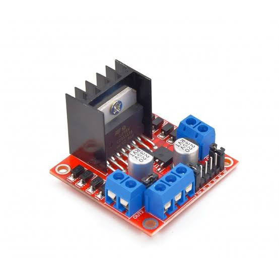

# Fire fighting bot

## Components you need.

### Flame Sensors

### Servo motor

### Motor Driver
#### I have used  L298n motor driver.

### Dc motors

.jpg)

### Arduino uno

#### Brain of the Bot

